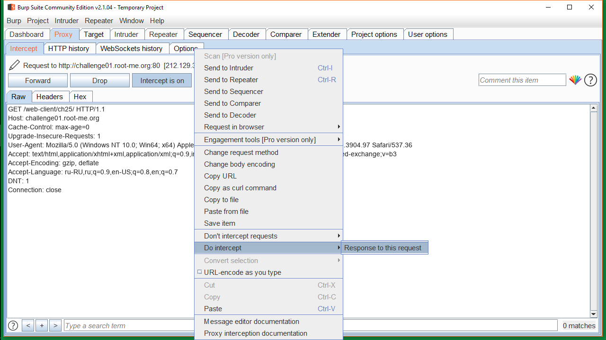
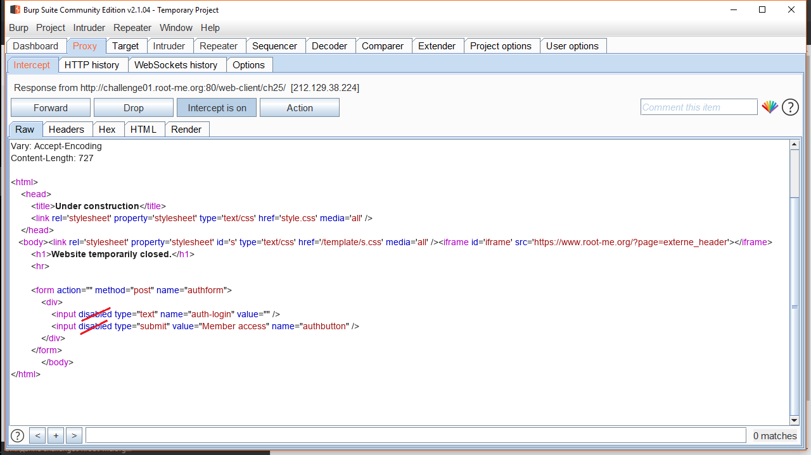
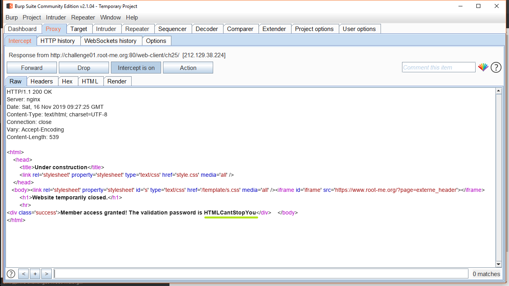

На страничке задания ячейки не кликабельны. 
Включаем <b>Burp</b>: <b>Proxy -> Intercept is on</b> 
Смотрим запрос серверу, там ничего необычного. (#1) 
<h2>#1</h2>
Смотрим ответ сервера: там видим, что у ячеек свойство <b>disabled</b>, из-за него не получается ввести что-то в ячейки.(#2) 
<h2>#2</h2>

Изменяем ответ сервера, удаляя <b>disabled</b>.
Ячейки на стрaничке задания открылись, что-то туда вводим, нажимаем <b>Member access</b>. 
В запросе серверу ничего интересного, в ответе сервера поздравление с открытием доступа:) и пароль: <b>HTMLCantStopYou</b> (#3)

<h2>#3</h2>

