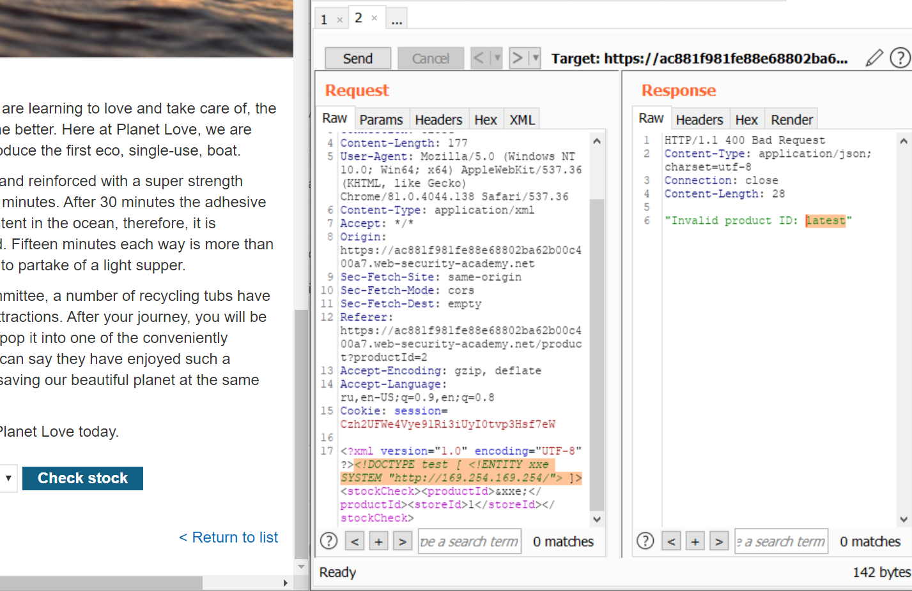
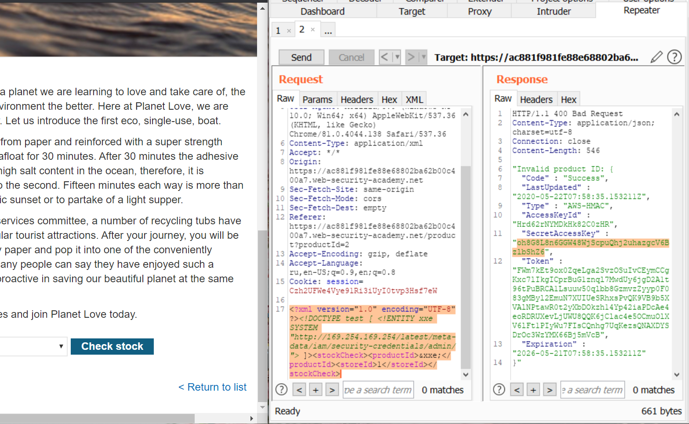

# Lab: Exploiting XXE to perform SSRF attacks
1) Смотрим запрос <b>Check stock</b> с XML-содержимым
2) Добавляем ссылку на сущность, хотим добраться до данных администратора 
 
3) Видим, что в ответ приходит  <b>"Invalid product ID:"</b> с указанием директории
4) Идём по этим директориям, пока не получим данные администратора 
 
