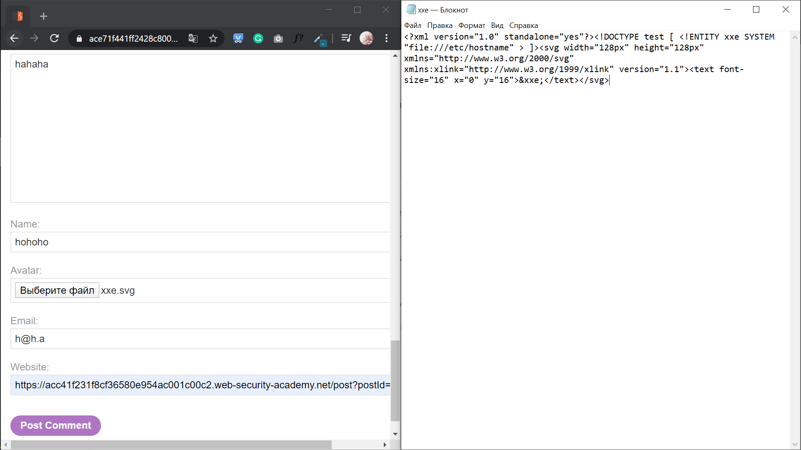
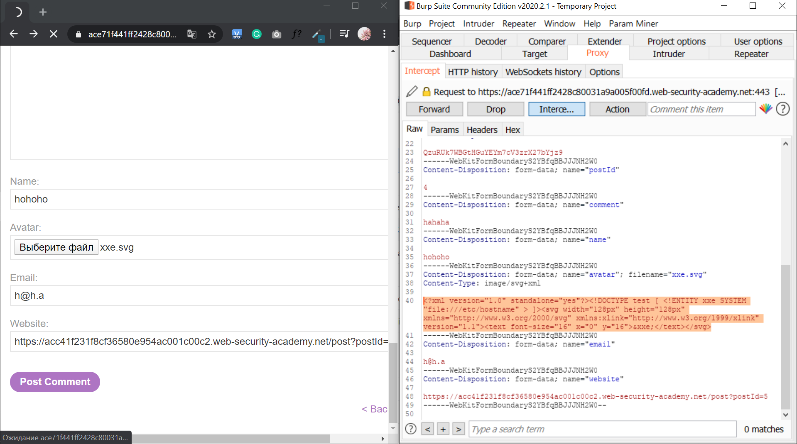
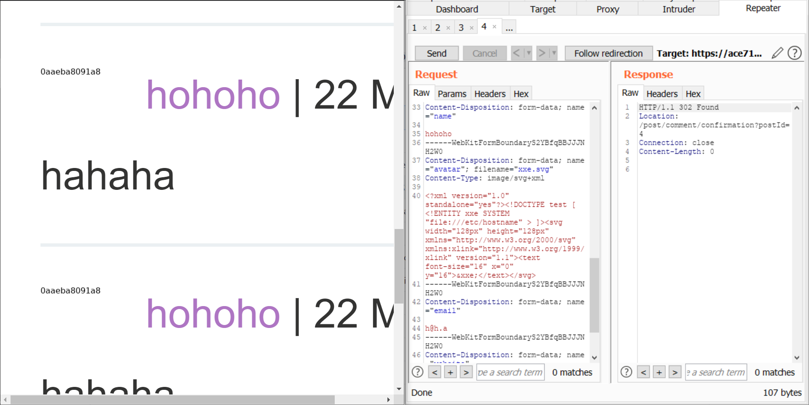

# Lab: Exploiting XXE via image file upload
1) Создаём <b>SVG</b> картинку с таким содержимым:   
2) Оставляем комментарий и загружаем аватарку - нашу <b>SVG</b> картинку с <b>XML</b>:  
3) Видим, что нужные данные появились у нас на аватарке:   
